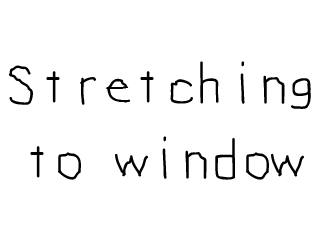

[[<-back](../README.md)]

# Optimized Surface Loading and Soft Stretching

Up until now we've been blitting our images raw. Since we were only showing one image, it didn't matter. When you're making a game, blitting images raw causes needless slow down. We'll be converting them to an optimized format to speed them up.

SDL 2 also has a new feature for SDL surfaces called soft stretching, which allows you to blit an image scaled to a different size. In this tutorial we'll take an image half the size of the screen and stretch it to the full size.



----

Back in our image loading function, we're going to make some modifications so the surface is converted on load. At the top of the function we pretty much [load images like we did in previous tutorials](../lesson-04/README.md), but we also declare a pointer to the final optimized image.

``` C++
SDL_Surface*    loadSurface( std::string path )
{
	// The final optimized image
	SDL_Surface*   optimizedSurface= NULL;

	// Load image at specified path
	SDL_Surface*   loadedSurface   = SDL_LoadBMP( path.c_str() );
	if ( loadedSurface == NULL )
	{
		printf( "Unable to load image %s! SDL Error: %s\n", path.c_str(), SDL_GetError() );
	}
```

If the image loaded successfully in the previous lines of code, we optimize the surface we loaded.

See when you load a bitmap, it's typically loaded in a 24bit format since most bitmaps are 24bit. Most, if not all, modern displays are not 24bit by default. If we blit an image that's 24bit onto a 32bit image, SDL will convert it every single time the image is blitted.

So what we're going to do when an image is loaded is convert it to the same format as the screen so no conversion needs to be done on blit. This can be done easily with SDL_ConvertSurface. All we have to do is pass in the surface we want to convert with the format of the screen.

It's important to note that [`SDL_ConvertSurface`](http://wiki.libsdl.org/SDL_ConvertSurface) returns a copy of the original in a new format. The original loaded image is still in memory after this call. This means we have to free the original loaded surface or we'll have two copies of the same image in memory.

After the image is loaded and converted, we return the final optimized image.

``` C++
	else
	{
		//    Convert surface to screen format
		optimizedSurface =
		  SDL_ConvertSurface( loadedSurface, gScreenSurface->format, 0 );
		if    ( optimizedSurface == NULL )
		{
			printf( "Unable to optimize image %s! SDL Error: %s\n", path.c_str(), SDL_GetError() );
		}

		//    Get rid of old loaded surface
		SDL_FreeSurface( loadedSurface );
	}

	return optimizedSurface;
}
```

SDL 2 has a new dedicated function to blit images to a different size: SDL_BlitScaled. Like [blitting images](../lesson-02/README.md) before, [`SDL_BlitScaled`](http://wiki.libsdl.org/SDL_BlitScaled) takes in a source surface to blit onto the destination surface. It also takes in a destination [`SDL_Rect`](http://wiki.libsdl.org/SDL_Rect) which defines the position and size of the image you are blitting.

So if we want to take an image that's smaller than the screen and make it the size of the screen, you make the destination width/height to be the width/height of the screen.

``` C++
				//  Apply the image stretched
				SDL_Rect stretchRect;
				stretchRect.x = 0;
				stretchRect.y = 0;
				stretchRect.w = SCREEN_WIDTH;
				stretchRect.h = SCREEN_HEIGHT;
				SDL_BlitScaled( gStretchedSurface, NULL, gScreenSurface, &stretchRect );
```

----

[[<-back](../README.md)]
