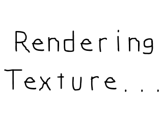

[[<-back](../README.md)]

# Texture Loading and Rendering

A major new addition to SDL 2 is the texture rendering API. This gives you fast, flexible hardware based rendering. In this tutorial we'll be using this new rendering technique.



---

Textures in SDL have their own data type intuitively called an [`SDL_Texture`](http://wiki.libsdl.org/SDL_Texture). When we deal with SDL textures you need an `SDL_Renderer` to render it to the screen which is why we declare a global renderer named "gRenderer".

As you can also see we have a new image loading routine with loadTexture and a globally declared texture we're going to load.

``` C++
//  Loads individual image as texture
SDL_Texture*    loadTexture ( std::string path );

//  The window we'll be rendering to
SDL_Window*     gWindow     = NULL;

//  The window renderer
SDL_Renderer*   gRenderer   = NULL;

//  Current displayed texture
SDL_Texture*    gTexture    = NULL;
```

After we create our window, we have to create a renderer for our window so we can render textures on it. Fortunately this is easily done with a call to [`SDL_CreateRenderer`](http://wiki.libsdl.org/SDL_CreateRenderer).

After creating the renderer, we want to initialize the rendering color using [`SDL_SetRenderDrawColor`](http://wiki.libsdl.org/SDL_SetRenderDrawColor). This controls what color is used for various rendering operations.

``` C++
        //  Create window
        gWindow     =
            SDL_CreateWindow(
                "SDL Tutorial"          ,
                SDL_WINDOWPOS_UNDEFINED ,
                SDL_WINDOWPOS_UNDEFINED ,
                SCREEN_WIDTH            ,
                SCREEN_HEIGHT           ,
                SDL_WINDOW_SHOWN
            );

        if  ( gWindow == NULL )
        {
            printf(
                "Window could not be created! "
                "SDL Error: %s\n"               ,
                SDL_GetError()
            );
            success = false;
        }
        else
        {
            //  Create renderer for window
            gRenderer   =
                SDL_CreateRenderer(
                    gWindow         ,
                    -1              ,
                    SDL_RENDERER_ACCELERATED
                );
            if  ( gRenderer == NULL )
            {
                printf(
                    "Renderer could not be created! "
                    "SDL Error: %s\n"                   ,
                    SDL_GetError()
                );
                success = false;
            }
            else
            {
                //  Initialize renderer color
                SDL_SetRenderDrawColor( gRenderer, 0xFF, 0xFF, 0xFF, 0xFF );

                //  Initialize PNG loading
                int imgFlags = IMG_INIT_PNG;
                if  ( !( IMG_Init( imgFlags ) & imgFlags ) )
                {
                    printf(
                        "SDL_image could not initialize! "
                        "SDL_image Error: %s\n"             ,
                        IMG_GetError()
                    );
                    success = false;
                }
            }
        }
```

Our texture loading function looks largely the same as before only now instead of converting the loaded surface to the display format, we create a texture from the loaded surface using [`SDL_CreateTextureFromSurface`](http://wiki.libsdl.org/SDL_CreateTextureFromSurface). Like before, this function creates a new texture from an existing surface which means like before we have to free the loaded surface and then return the loaded texture.

``` C++
SDL_Texture*    loadTexture ( std::string path )
{
    //  The final texture
    SDL_Texture*    newTexture = NULL;

    //  Load image at specified path
    SDL_Surface*    loadedSurface = IMG_Load( path.c_str() );
    if  ( loadedSurface == NULL )
    {
        printf(
            "Unable to load image %s! "
            "SDL_image Error: %s\n"     ,
            path.c_str()                ,
            IMG_GetError()
        );
    }
    else
    {
        //  Create texture from surface pixels
        newTexture  =
            SDL_CreateTextureFromSurface( gRenderer, loadedSurface );
        if  ( newTexture == NULL )
        {
            printf(
                "Unable to create texture from %s! "
                "SDL Error: %s\n"                   ,
                path.c_str()                        ,
                SDL_GetError()
            );
        }

        //  Get rid of old loaded surface
        SDL_FreeSurface( loadedSurface );
    }

    return newTexture;
}
```

Since texture loading is abstracted with our image loading function, the loadMedia() function works pretty much the same as before.

In our clean up function, we have to remember to deallocate our textures using [`SDL_DestroyTexture`](http://wiki.libsdl.org/SDL_DestroyTexture).

``` C++
bool loadMedia()
{
    //  Loading success flag
    bool success = true;

    //  Load PNG texture
    gTexture = loadTexture( "./texture.png" );
    if  ( gTexture == NULL )
    {
        printf( "Failed to load texture image!\n" );
        success = false;
    }

    return success;
}

void close()
{
    //  Free loaded image
    SDL_DestroyTexture( gTexture );
    gTexture = NULL;

    //  Destroy window
    SDL_DestroyRenderer ( gRenderer );
    SDL_DestroyWindow   ( gWindow );
    gWindow     = NULL;
    gRenderer   = NULL;

    //  Quit SDL subsystems
    IMG_Quit();
    SDL_Quit();
}
```

In the [main loop](../lesson-03/README.md) after the event loop, we call [`SDL_RenderClear`](http://wiki.libsdl.org/SDL_RenderClear). This function fills the screen with the color that was last set with `SDL_SetRenderDrawColor`.

With the screen cleared, we render the texture with [`SDL_RenderCopy`](http://wiki.libsdl.org/SDL_RenderCopy). With the texture rendered, we still have to update the screen, but since we're not using SDL_Surfaces to render we can't use `SDL_UpdateWindowSurface`. Instead we have to use [`SDL_RenderPresent`](http://wiki.libsdl.org/SDL_RenderPresent).

``` C++
            //  While application is running
            while   ( !quit )
            {
                //  Handle events on queue
                while   ( SDL_PollEvent( &e ) != 0 )
                {
                    //  User requests quit
                    if  ( e.type == SDL_QUIT )
                    {
                        quit = true;
                    }
                }

                //  Clear screen
                SDL_RenderClear ( gRenderer );

                //  Render texture to screen
                SDL_RenderCopy  ( gRenderer, gTexture, NULL, NULL );

                //  Update screen
                SDL_RenderPresent( gRenderer );
            }
```

---

[[<-back](../README.md)]
