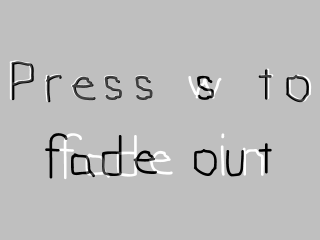
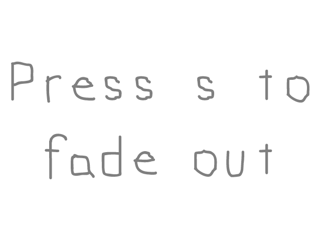
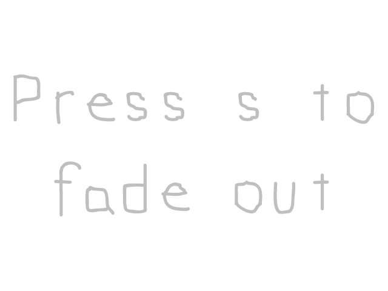

# Alpha Blending



Thanks to new hardware accelerated rendering, transparency is much faster in SDL 2.0. Here we'll use alpha modulation (which works much like color modulation) to control the transparency of a texture.

------
### Texture
Here we're going to add two functions to support alpha transparency on a texture. First there's __`setAlpha`__ which will function much like __`setColor`__ did in the color modulation tutorial. There's also __`setBlendMode`__ which will control how the texture is blended. In order to get blending to work properly, you must set the blend mode on the texture. We'll cover this in detail later. 

``` C++
// Texture wrapper class
class LTexture
{
	public:
		// Initializes variables
		LTexture();

		// Deallocates memory
		~LTexture();

		// Loads image at specified path
		bool loadFromFile( std::string path );

		// Deallocates texture
		void free();

		// Set color modulation
		void setColor( Uint8 red, Uint8 green, Uint8 blue );

		// Set blending
		void setBlendMode( SDL_BlendMode blending );

		// Set alpha modulation
		void setAlpha( Uint8 alpha );
		
		// Renders texture at given point
		void render( int x, int y, SDL_Rect* clip = NULL );

		// Gets image dimensions
		int getWidth();
		int getHeight();

	private:
		// The actual hardware texture
		SDL_Texture* mTexture;

		// Image dimensions
		int mWidth;
		int mHeight;
};

```

------
### loadMedia()
Here in the texture loading function we're loading the front texture we're going to alpha blend and a background texture. As the front texture gets more transparent, we'll be able to see more of the back texture. As you can see in the code, after we load the front texture successfully we set the [SDL BlendMode](http://wiki.libsdl.org/SDL_BlendMode) to blend, so blending is enabled. Since the background isn't going to be transparent, we don't have to set the blending on it.

Now how does alpha work? Alpha is opacity, and the lower the opacity the more we can see through it. Like red, green, or blue color components it goes from 0 to 255 when modulating it. The best way to understand it is with some examples. Say if we had the front image on a white background.

``` C++
bool loadMedia()
{
	// Loading success flag
	bool success = true;

	// Load front alpha texture
	if	( !gModulatedTexture.loadFromFile( "./fadeout.png" ) )	{
		printf( "Failed to load front texture!\n" );
		success = false;
	}
	else	{
		// Set standard alpha blending
		gModulatedTexture.setBlendMode( SDL_BLENDMODE_BLEND );
	}

	// Load background texture
	if	( !gBackgroundTexture.loadFromFile( "./fadein.png" ) )	{
		printf( "Failed to load background texture!\n" );
		success = false;
	}
	
	return success;
}
```

------
### alpha examples
This is the front image at 255 (100% alpha)


------
This is the front image at 255 (75% alpha)


------
This is the front image at 255 (50% alpha)


------
This is the front image at 255 (25% alpha)


------
This is the front image at 255 (0% alpha)


As you can see, the lower the alpha the more transparent it is.

------
### SDL functions
Here are the actual SDL functions that do the actual work. [SDL_SetTextureBlendMode](http://wiki.libsdl.org/SDL_SetTextureBlendMode) in __`setBlendMode`__ allows us to enable blending and [SDL_SetTextureAlphaMod](http://wiki.libsdl.org/SDL_SetTextureAlphaMod) allows us to set the amount of alpha for the whole texture. 

``` C++
void LTexture::setBlendMode( SDL_BlendMode blending )
{
	// Set blending function
	SDL_SetTextureBlendMode( mTexture, blending );
}
		
void LTexture::setAlpha( Uint8 alpha )
{
	// Modulate texture alpha
	SDL_SetTextureAlphaMod( mTexture, alpha );
}
```

------
### alpha
Right before entering the main loop, we declare a variable to control how much alpha the texture has. It is initialized to 255 so the front texture starts out completely opaque. 
``` C++
			// Main loop flag
			bool quit = false;

			// Event handler
			SDL_Event e;

			// Modulation component
			Uint8 a = 255;

			// While application is running
			while ( !quit )	{
```

------
### Varying alpha
The event loop handles quit events and making the alpha value go up/down with the __`w`__/__`s`__ keys. 
``` C++
				// Handle events on queue
				while ( SDL_PollEvent( &e ) != 0 )	{
					// User requests quit
					if	( e.type == SDL_QUIT )	{
						quit = true;
					}
					// Handle key presses
					else
						if	( e.type == SDL_KEYDOWN )	{
							// Increase alpha on w
							if	( e.key.keysym.sym	== SDLK_w )	{
								// Cap if over 255
								if	( a + 32 > 255 )	{
									a = 255;
								}
								// Increment otherwise
								else	{
									a += 32;
								}
							}
							// Decrease alpha on s
							else
								if	( e.key.keysym.sym	== SDLK_s )	{
									// Cap if below 0
									if	( a - 32 < 0 )	{
										a = 0;
									}
									// Decrement otherwise
									else	{
										a -= 32;
									}
								}
						}
				}
```

------
### Rendering
At the end of the main loop we do our rendering. After clearing the screen we render the background first and then we render the front modulated texture over it. Right before rendering the front texture, we set its alpha value. Try increasing/decreasing the alpha value to see how transparency affects the rendering.

``` C++
				// Clear screen
				SDL_SetRenderDrawColor	( gRenderer, 0xFF, 0xFF, 0xFF, 0xFF );
				SDL_RenderClear			( gRenderer );

				// Render background
				gBackgroundTexture.render( 0, 0 );

				// Render front blended
				gModulatedTexture.setAlpha( a );
				gModulatedTexture.render( 0, 0 );

				// Update screen
				SDL_RenderPresent( gRenderer );
```